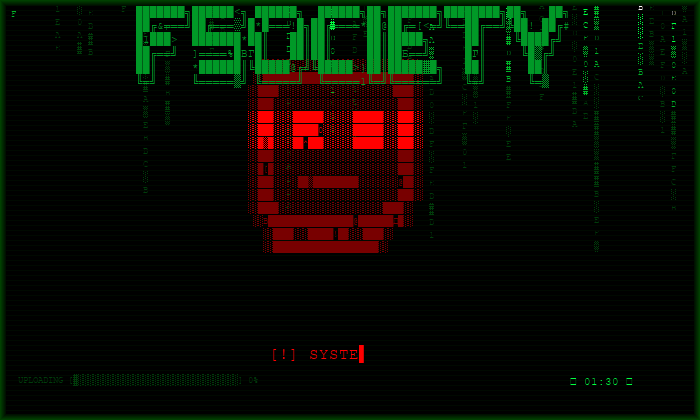

# FSociety Prank

> *"Hello, friend."* — Mr. Robot



A theatrical hacker prank simulator inspired by the TV show **Mr. Robot** and the fictional hacker collective **FSociety**.  
**Nothing is actually hacked, encrypted, or damaged.** Pure visual and audio terror.


---

## What it does

**Phase 1 — Popup wave**
- 14 popup windows spawn rapidly across the screen
- Each popup shows a Petya ransomware–style ASCII skull with a glitching animation
- Fake progress bars, fake title bars, scary status messages
- Every popup shakes violently on spawn with a horror sound burst

**Phase 2 — Fullscreen fake lockscreen**
- Fullscreen takeover with a large Unicode-block skull
- Animated matrix rain (green falling characters with brightness gradient)
- CRT scanline overlay
- Typing-cursor animation for the main message
- 90-second countdown timer (decorative)
- Fake upload progress bar: `UPLOADING TO F-SOCIETY SERVER`
- Cycling hacker status messages (`Dumping LSASS memory...`, `Lateral movement via SMB relay...`, etc.)
- Random screen flashes (red / white / orange) with synchronized scary sounds
- Every flash triggers all open popups to shake simultaneously

## Sounds

Five scary audio patterns (via `winsound.Beep`) chosen at random:

| Pattern | Effect |
|---------|--------|
| Industrial alarm | Descending wail 1800 → 800 Hz |
| Sub-bass boom + screech | Deep 80 Hz thud → 2000 Hz screech |
| Horror drone | Rising pulse ending in a spike |
| Glitch burst | Chaotic random frequency spikes |
| Nuclear alarm | Rhythmic siren like a film countdown |

## Requirements

- Windows (uses `winsound` and `tkinter`, both built into Python)
- Python 3.7+

No external dependencies.

## Usage

```bash
python fsociety.py
```

**To exit:** press `Ctrl+Shift+Q` — closes everything instantly.  
The prank also self-terminates after 90 seconds.

## Disclaimer

This is a **harmless visual prank**. It does not:
- encrypt or delete any files
- lock the actual OS or input devices
- make any network connections
- install anything

Use responsibly. Only run on your own machine or with full consent of the target.

---

*Inspired by [Mr. Robot](https://www.imdb.com/title/tt4158110/) — Season 1, Episode 1.*
